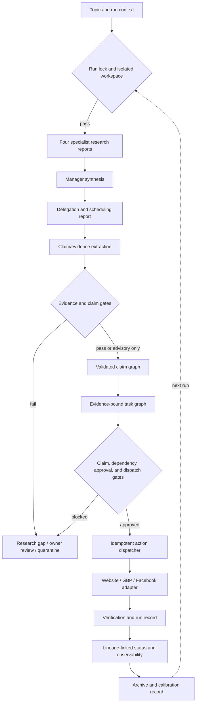

# SEO Agents App — Final Evidence-Bound Research-to-Execution Plan

**Status:** Execution-ready plan only. No application implementation is authorized by this document.

**Prepared:** 2026-07-14

**Repository:** `C:\Workspace\Active\SEO-Agents-App`

**Scope:** Finish and safely activate the research-agent upgrade already introduced by the recent evidence, claim, task-lineage, observability, recovery, idempotency, and regression commits.

## 1. Outcome

The completed system must make the research-to-execution path evidence-bound from end to end:



The automatic weekly path and the explicit `run-action` path must use the same validated task and dispatch authority. Raw Markdown may remain as a human-readable projection, but it may not be the authority for live side effects.

## 2. Current baseline and already-landed work

The following commits are already present and must be treated as existing implementation, not recreated:

| Commit | Existing capability |
|---|---|
| `b64e811` | Evidence, claim, execution-task, run-manifest contracts and writers |
| `1a3cb77` | Evidence provenance, freshness, contradiction, confidence, and secret gates |
| `1813347` | Action lineage fields, dependency detection, task graph translation, contradiction research gaps |
| `8d7ccb7` | Observability helpers, failure classification, recovery helpers, idempotency helper |
| `f32d415` | Research regression fixtures and proposed metrics |
| `a0e5965` | Idempotency and recovery unit tests |
| `958437f` | Watchdog/T10 regression tests |
| `e40de4c` | Calibration and handoff records |

Current verification baseline:

- Python suite: `164 passed`.
- Node helper suite: `6 passed`.
- `validate --json` currently returns success even when evidence and claim artifacts are empty; this is not a go-live signal.
- `src/seo_agents/claims_extract.py` and the integration tests for extraction, finalization, dispatch gating, and CLI idempotency do not yet exist.
- Live `outputs/evidence_package.json` and `outputs/claim_graph.json` are currently empty.
- Current reports are stale relative to this upgrade and must not be used as proof of live extraction.
- The scheduled task currently targets Friday at 08:30, but schedule readiness does not prove pipeline readiness.

Relevant runtime boundaries:

- Research orchestration: `src/seo_agents/main.py`, `src/seo_agents/crew.py`.
- Evidence contracts and gates: `src/seo_agents/contracts.py`, `src/seo_agents/evidence.py`.
- Action parsing, task translation, dispatch, recovery, and idempotency: `src/seo_agents/actions.py`.
- Status projection: `src/seo_agents/status.py`.
- Observability: `src/seo_agents/observability.py`.
- Human-readable contracts: `prompts/agents/*.txt`.
- Scheduled wrapper: `scripts/run-weekly-seo.py`.

## 3. Non-goals and hard constraints

- Do not replace CrewAI, the approval workflow, the website adapter, or scheduled GBP-worker ownership.
- Do not restart, stop, or close the GBP worker, `mav-bridge`, PM2 services, or unrelated processes.
- Do not publish to GBP, Facebook, or the website during offline implementation work.
- Do not write to Supabase during dry-run, offline verification, or calibration unless a task explicitly documents a read-only requirement and proves it is read-only.
- Never hardcode secrets. Use `.env`/dotenv and preserve existing secret-quarantine behavior.
- Preserve existing Markdown report markers and existing action-queue fields.
- Do not promote a model assertion into confirmed evidence merely because it contains a claim block.
- Do not use synthetic authority, recency, corroboration, or source URI values as if they were observed facts.
- Do not enable automatic retries for GBP `live_unverified` results.
- Do not execute a live adapter until every production gate in Section 13 passes.
- Every implementation task must end at a verified commit boundary and must preserve unrelated user changes.
- Plan files remain local planning artifacts unless the repository owner explicitly requests otherwise.

## 4. Required data invariants

### 4.1 Run identity

Every invocation must have one `run_id` generated before research starts and passed through all stages.

The run ID must be:

- unique for concurrent invocations;
- stable for all artifacts produced by that invocation;
- safe for filenames;
- present in the manifest, evidence package, claim graph, task graph, action queue, run records, workflow status, and observability events;
- never inferred from the first evidence item when the evidence list is empty.

The implementation must distinguish the invocation ID from any optional deterministic topic fingerprint. A deterministic topic fingerprint may support deduplication, but it must not replace a unique live-run identity.

### 4.2 Evidence and claims

Every durable claim must have:

- a syntactically valid stable claim ID;
- an atomic statement;
- claim type;
- source mode and source-specific provenance;
- retrieval timestamp or an explicit unavailable reason;
- evidence excerpt or structured observation;
- confidence label and basis;
- relation;
- freshness/supersession metadata;
- supporting report and run ID;
- status derived from validation, not hardcoded by the extractor.

The extractor must preserve unknowns. It may assign `provisional` or `unknown`, but it must not assign `confirmed` solely because a report contains the required Markdown fields.

Every contradiction reference must be retained, including references to missing claim IDs. Unknown contradiction endpoints are a gate failure or research gap, not something silently discarded.

### 4.3 Tasks

Every executable task must have:

- at least one claim ID that exists in the current run's claim graph;
- no rejected, unknown, unavailable, or unresolved-contradiction claim unless the task is explicitly a research-gap or owner-review task;
- owner, priority, formula version, confidence, dependencies, preconditions, acceptance criteria, verification, rollback, approval class, uncertainty, idempotency key, and run ID;
- a status consistent with all gates.

Explicit exceptions must be modeled, not implied:

- `research_gap` tasks may have no supporting claims but must contain a gap reason;
- owner/access tasks may be supported by owner-input or tool-access evidence;
- GBP/Facebook scheduled-content actions must either carry claims from the research run or be explicitly marked as a separate approval-bound content schedule class with its own evidence policy. Empty claim lists may not silently become executable.

### 4.4 Gate semantics

The following are hard failures for live promotion:

- missing or invalid provenance;
- invalid or missing run lineage;
- stale evidence where freshness is required;
- unresolved material contradictions;
- unknown claim references;
- rejected claims;
- missing supporting claims on ordinary executable tasks;
- dependency cycles or blocked dependencies;
- potential secrets;
- missing required approval;
- missing adapter preconditions;
- stale or mixed-run artifacts.

Warnings may remain advisory only when explicitly classified as advisory and when they do not affect live safety.

## 5. Phase 0 — Handoff preparation and repository hygiene

This phase is complete for the current handoff except for the final verification steps below.

### Tasks

1. Confirm the competing source plans are archived under the existing folder:

   `C:\Workspace\Archive\Build Plans\SEO-Agents-App\`

2. Keep only the revised execution plan at the repository root as `PLAN.md`.

3. Decide and document `.gitignore` treatment for local plan files. If plans remain local, ignore both the root `PLAN.md` and any future root `Fable-PLAN.md`; do not leave one accidentally untracked.

4. Do not delete or rewrite unrelated archive history.

5. Before implementation begins, record:

   ```powershell
   git status --short --branch
   python -m pytest -q
   node --test scripts\lib\*.test.mjs
   ```

### Completion gate

- Archived source plans exist and are readable.
- Root `PLAN.md` exists and is the only active plan intended for execution.
- No implementation files were changed in this phase.
- Baseline tests are recorded.

## 6. Phase 1 — Run isolation and dry-run safety

### Task 1.1 — Make dry-run truly offline

**Files:** `src/seo_agents/main.py`, new dry-run tests.

Move the dry-run decision ahead of every external or mutating research preparation step.

On `research --dry-run`, prove that the process does not:

- call `compact_baselines()`;
- modify, archive, or delete baseline files;
- call `_fetch_completed_tasks()` or any Supabase endpoint;
- call a live LLM;
- call a live adapter;
- start execution, GBP scheduling, Facebook scheduling, or Supabase sync.

The dry-run may construct crew configuration and write a manifest/projection, but all artifacts must be marked `dry_run=true` and must not be mistaken for live evidence.

### Task 1.2 — Add `--skip-execute`

Add `research --skip-execute` for supervised research-only runs.

Required behavior:

- research agents and synthesis may run;
- claim extraction and gate evaluation may run;
- automatic execution, GBP schedule generation, Facebook schedule generation, adapter dispatch, and Supabase sync do not run;
- the result clearly records `research_only=true` or equivalent run-mode metadata;
- the flag does not weaken evidence validation.

### Task 1.3 — Establish run context, workspace, and lock

Create a run-context helper used by research, finalization, task translation, status, and dispatch.

The helper must provide:

- unique invocation ID;
- topic fingerprint if useful;
- run start time;
- provider/model route metadata;
- site, region, audience, and keywords;
- isolated working/archive paths;
- an exclusive run lock.

Overlapping runs must fail cleanly with an observable reason. Never merge reports from two invocations in the shared projection directory.

Preserve existing human-readable `outputs/*.md` projections only through an atomic, run-aware promotion step after the current run is complete.

### Task 1.4 — Fix writer lineage and path injection

Update evidence, claim, task, manifest, status, and observability writers so:

- run ID is an explicit parameter where required;
- empty collections still receive the current run ID;
- tests can inject a temporary output directory without monkeypatching unrelated module constants;
- writes are atomic without losing prior events;
- no absolute repository path is embedded in reusable contracts.

### Verification

Add tests that:

- monkeypatch every external preparation function and assert it is not called during dry-run;
- snapshot baseline file names and hashes before/after dry-run;
- prove `--skip-execute` does not invoke `_run_execute_pipeline()`;
- prove concurrent run acquisition rejects the second invocation;
- prove empty artifacts preserve the supplied run ID;
- prove two observability events remain two events in the JSONL file.

## 7. Phase 2 — Claim extraction and truthful evidence normalization

### Task 2.1 — Create `claims_extract.py`

Create:

`src/seo_agents/claims_extract.py`

with tested interfaces for:

- extracting claim blocks from specialist reports;
- extracting manager contradictions;
- collecting all reports for one run;
- building a claim graph;
- reporting malformed, missing, duplicate, and unknown metadata;
- returning extraction diagnostics, not only lists of dictionaries.

The report set is:

- `content_report.md`;
- `website_report.md`;
- `gbp_report.md`;
- `reputation_report.md`;
- `grizzly_local_presence_plan.md`.

The parser must tolerate harmless Markdown variation such as blank lines and field order changes, but it must reject ambiguous or incomplete blocks into diagnostics rather than silently inventing fields.

### Task 2.2 — Implement source-specific provenance

Do not map every live claim to `live_page` and the site homepage.

The normalizer must distinguish at least:

- website page evidence;
- SERP/search evidence;
- GBP/public-profile evidence;
- reputation/review evidence;
- policy evidence;
- baseline evidence;
- owner-provided input;
- unavailable/tool-access evidence.

If the report does not contain enough information to identify the source, preserve `source_mode` and mark the evidence as provisional/unknown with a gate or research gap. Do not fill the URI, title, authority, or method from assumptions.

### Task 2.3 — Validate claim blocks

Validation must cover:

- claim ID format and stability;
- supported claim type;
- source mode;
- timestamp parseability and timezone;
- negative finding presence;
- statement/excerpt non-emptiness;
- report marker and report identity;
- run identity;
- contradiction endpoint existence;
- duplicate claim behavior;
- status transition rules.

Unavailable evidence must retain an explicit unavailable reason and must not be represented as an empty source kind.

### Task 2.4 — Derive status and confidence conservatively

The extractor must not assign fixed confidence scores such as `0.6` merely from `Source Mode: live`.

Confidence must either be:

- explicitly supported by validated report metadata and method evidence; or
- set to unknown/provisional with a documented basis.

Promotion to `confirmed` must occur only after the existing gates and any required corroboration rules pass.

Baseline freshness and supersession must be evaluated explicitly. A baseline claim must not bypass freshness checks merely because its source kind is `baseline`.

### Task 2.5 — Preserve contradiction integrity

Contradictions must be represented as first-class graph edges or gate records even when one endpoint is missing.

The graph builder must not silently discard contradiction pairs that do not correspond to extracted claims.

### Verification

Add fixtures/tests for:

- valid live website evidence;
- valid SERP evidence;
- baseline evidence that is fresh;
- stale baseline evidence;
- unavailable evidence;
- malformed timestamps;
- missing source URI with no usable source kind;
- negative findings;
- duplicate claim IDs;
- malformed/reordered claim blocks;
- unknown contradiction endpoints;
- claims with multiple evidence units;
- secret-like excerpts;
- empty reports and missing reports.

## 8. Phase 3 — Finalization and gate integration

### Task 3.1 — Add one run finalizer

Implement a finalizer that receives the current run context and:

1. freezes or snapshots the current run reports;
2. extracts evidence and claims;
3. validates evidence and claim graphs;
4. writes lineage-linked artifacts;
5. emits gate events;
6. writes extraction diagnostics;
7. returns a structured result with counts, failures, warnings, and run ID.

The finalizer must not silently replace a failed package with an empty package.

### Task 3.2 — Define live finalization behavior

For a live/research-only run:

- zero extracted claims is a failed extraction gate unless the run explicitly records that all relevant tools were unavailable;
- failed evidence gates create research-gap or owner-review state;
- claims remain non-promotable until validation succeeds;
- task generation may continue for review/reporting but may not promote unsafe tasks;
- automatic execution must stop before any adapter side effect when the hard gate fails.

### Task 3.3 — Integrate finalization before execution

Replace the current empty writes in the live research path.

The call order must become:

```text
research kickoff
→ archive current run reports
→ finalize evidence and claims
→ validate claims and gates
→ build validated task/action graph
→ stop or continue according to gate result
→ execute only through the authoritative dispatcher
```

The old path that writes empty evidence/claim JSON and immediately starts `_run_execute_pipeline()` must not remain.

### Task 3.4 — Make validation fail meaningfully

`validate --json` must distinguish:

- valid dry-run with intentionally empty evidence;
- valid research-only run with populated evidence;
- live run with missing extraction;
- stale or mixed-run artifacts;
- gate failure;
- malformed artifact.

An empty evidence package after a live research run must not return a clean production validation result.

## 9. Phase 4 — Evidence-bound task translation

### Task 4.1 — Validate queue claim references

Before writing `task_graph.json`, load the current run's claim graph and validate every `supporting_claim_id`.

Reject or convert to research gaps:

- IDs absent from the claim graph;
- IDs from another run;
- rejected claims;
- unknown claims;
- claims with failed material gates;
- tasks with ordinary executable types and no claim IDs.

Do not use a prefix check as referential integrity.

### Task 4.2 — Preserve task semantics

Keep existing action fields while adding:

- run ID;
- task ID;
- claim references;
- priority and formula version;
- confidence and basis;
- dependencies;
- preconditions;
- acceptance criteria;
- verification;
- rollback;
- approval class;
- uncertainty;
- idempotency key;
- gate status and blocking reasons.

### Task 4.3 — Enforce dependency rules

Dependency validation must:

- detect cycles;
- detect references to unknown tasks;
- block tasks whose dependencies are blocked or unresolved;
- preserve explicit research-gap dependencies;
- prevent ready/approved promotion when a prerequisite is not satisfied.

### Task 4.4 — Define schedule-action policy

Document and test the policy for GBP and Facebook scheduled posts.

The implementation must choose one of these explicit behaviors:

1. bind every post to one or more research claims;
2. classify scheduled content as a separate evidence policy with mandatory owner approval and documented source inputs;
3. mark unbound posts as non-executable research gaps.

The implementation may not leave these actions with empty claim lists while treating them as ordinary executable tasks.

### Task 4.5 — Make the task graph authoritative

The automatic execution path must read the validated task graph/action queue, not raw `grizzly_execution_queue.md` alone.

The executor may use Markdown for task context, but it must receive only tasks that are:

- from the current run;
- validated;
- dependency-ready;
- approval-compliant;
- adapter-ready;
- not blocked by evidence gates.

Any deliverable-producing executor may propose changes, but live side effects must flow through the same action dispatcher used by `run-action`.

## 10. Phase 5 — Dispatch, approval, idempotency, and recovery

### Task 5.1 — Add a complete dispatch gate

The dispatch gate must check, at minimum:

- current run ID;
- task graph status;
- claim references and claim statuses;
- unresolved contradictions;
- evidence gate failures;
- dependency readiness;
- approval requirements;
- adapter availability;
- live/dry-run mode;
- action idempotency key;
- stale action/run records.

The gate must run immediately before any live adapter invocation, even if an earlier queue-build gate passed.

### Task 5.2 — Route all live actions through idempotency

The CLI must route through `enforce_idempotency()`.

The automatic execution path must use the same enforcement path. Direct live calls to `run_action()` must be removed or made impossible for production callers.

Idempotency must use an atomic reservation/lock so two concurrent invocations cannot both pass the prior-run check.

The stored run record must include:

- action ID;
- idempotency key;
- run ID;
- reservation state;
- adapter result;
- final status;
- creation and completion timestamps;
- dedupe outcome.

### Task 5.3 — Preserve GBP duplicate-post protection

`live_unverified` must remain a distinct state.

It must:

- never be automatically retried;
- never be silently converted to `adapter_failed`;
- require explicit owner verification before another attempt;
- preserve the original adapter result and evidence.

Website push failures may have their own recovery class but must not inherit GBP duplicate-post behavior blindly.

### Task 5.4 — Classify failures from the actual result

Failure classification must receive the actual adapter result, not a stale reconstructed action.

Classification tests must prove meaningful mappings for:

- timeout/network failure → transient retry candidate;
- missing access/tool → evidence access;
- contradiction → contradiction stall;
- low/unknown confidence → confidence gap;
- secret detection → quarantine;
- unknown failure → unknown.

Recovery is recorded first. No automatic retry loop is enabled by this plan. Any future retry must have a bounded attempt count, persistent reservation, and explicit review.

### Task 5.5 — Fix observability persistence

Observability writes must append safely without replacing prior events.

Every event must include:

- run ID;
- task/action ID when applicable;
- gate ID when applicable;
- timestamp;
- producer;
- event type;
- schema version;
- proposed/advisory status where applicable;
- outcome and blocking reason.

Integrate events at research completion, finalization, queue build, gate evaluation, approval, dispatch, adapter result, verification, dedupe, failure classification, and recovery boundaries.

## 11. Phase 6 — Prompt and parser contracts

### Specialist reports

The four specialist prompts must make the claim block part of the required output structure, not only a backstory instruction.

Each durable finding/recommendation must include an exact machine-readable block containing:

```text
**Claim ID:** claim_<stable_hash>
**Claim Type:** observation|policy|recommendation|hypothesis|negative_finding
**Source Mode:** live|baseline|unavailable
**Source Kind:** live_page|serp|google_policy|baseline|owner_input|tool_output|unavailable
**Source URI:** <URI or unavailable>
**Retrieved At:** <ISO-8601 or unavailable>
**Negative Findings:** <explicit result or none identified>
```

Existing `[START:X]` and `[END:X]` markers must remain unchanged.

### Manager report

The manager must emit contradictions exactly as:

```text
**Contradiction:** claim_<hash_a> vs claim_<hash_b> — <one-line reason>
```

It must also identify missing or unavailable evidence without inventing claim IDs.

### Delegation report

Every ordinary task block must emit:

```text
**Supporting Claim IDs**: claim_<hash>, claim_<hash>
```

Research-gap tasks must emit:

```text
**Supporting Claim IDs**: none
**Gap Reason**: <specific missing evidence or access condition>
```

The scheduler must not promote tasks merely because the line parses. It must validate IDs against the current claim graph.

## 12. Phase 7 — Offline verification and regression coverage

### Required test files

Add or extend tests for:

- `tests/test_dry_run_offline.py`
- `tests/test_claims_extract.py`
- `tests/test_live_evidence_wiring.py`
- `tests/test_dispatch_gate.py`
- `tests/test_run_action_cli.py`
- `tests/test_run_isolation.py`
- `tests/test_observability_persistence.py`
- existing evidence, task translation, idempotency, recovery, and regression suites.

### Required integration scenarios

1. Dry-run calls no LLM, Supabase, baseline mutation, scheduler, or adapter.
2. Research-only mode performs research but does not execute.
3. A valid report set produces populated evidence and claims with one run ID.
4. A missing claim block creates an extraction diagnostic and prevents unsafe promotion.
5. A malformed timestamp does not become valid freshness metadata.
6. An unavailable source remains explicit and cannot silently become confirmed.
7. An unknown contradiction endpoint remains visible and blocks promotion.
8. A task referencing an unknown claim becomes a research gap.
9. A task referencing a rejected claim is blocked.
10. A task with a dependency cycle is blocked.
11. A valid task is dispatched only after approval and all gates pass.
12. The automatic execution path cannot bypass the validated task graph.
13. Two concurrent calls with the same idempotency key produce one adapter invocation.
14. GBP `live_unverified` is never automatically retried.
15. Failure records contain a meaningful failure class and recovery note.
16. Two or more observability events persist in order.
17. Empty artifacts retain the current run ID and are rejected as live completion artifacts.
18. Current Node helper tests remain green.

### Offline commands

```powershell
$env:PYTHONPATH = 'src'
python -m pytest -q
node --test scripts\lib\*.test.mjs
python -m seo_agents.main research "offline verification" --dry-run
python -m seo_agents.main validate --json
```

No command in this phase may invoke a live adapter, write to Supabase, publish content, or start a scheduled task.

## 13. Phase 8 — Supervised calibration

Calibration begins only after all offline gates pass and a separate review confirms that the automatic executor cannot bypass the task graph.

### Calibration rules

- Use `research --skip-execute`.
- Do not call live adapters.
- Do not publish to GBP, Facebook, or the website.
- Do not alter Supabase data.
- Use three representative topics with different evidence profiles.
- Preserve each cycle's manifest, reports, extraction diagnostics, evidence package, claim graph, task graph, and observability events.
- Store calibration records in a deliberate non-ignored documentation/archive location.
- Do not tune thresholds from one run.

### Required calibration metrics

Use one definition consistently across code, tests, and records:

- specialist claim-block emission rate;
- extraction yield;
- malformed-block rate;
- unknown-source rate;
- confirmed/provisional/unknown/rejected distribution;
- stale evidence rate;
- contradiction density;
- unknown claim-reference rate;
- evidence-to-task binding rate;
- blocked-task rate by reason;
- dependency-cycle rate;
- task priority distribution;
- research-gap creation and closure;
- idempotency/dedupe outcomes;
- gate pass/fail counts;
- cost and latency by phase.

Priority calibration must use evidence-derived confidence. The existing action-risk heuristic may not be treated as evidence confidence.

### Calibration success bar

Before production consideration:

- at least 80% of emitted claim blocks are extracted correctly;
- every specialist report contains at least one valid or explicitly unavailable claim block;
- no unknown claim references are promoted;
- no live task bypasses the task graph;
- all hard gate failures produce visible blocked/research-gap state;
- all artifacts for a cycle share one run ID;
- no adapter or Supabase write occurs;
- threshold decisions are documented and versioned.

If extraction yield is below the bar, stop calibration and fix the prompt/parser contract before another cycle.

## 14. Phase 9 — Production preflight and watched run

Production is blocked until the following checklist is complete.

### Preflight

```powershell
Get-ScheduledTaskInfo -TaskName 'Grizzly SEO Photo Sync'
Get-ScheduledTaskInfo -TaskName 'Grizzly SEO Weekly Run'
Get-ScheduledTaskInfo -TaskName 'Grizzly SEO Monitor'
git status --short --branch
python -m pytest -q
node --test scripts\lib\*.test.mjs
```

Verify:

- scheduled tasks are armed for the intended date/time;
- no other SEO run holds the run lock;
- the working tree is clean except for explicitly permitted local artifacts;
- adapters report expected readiness;
- current outputs are archived or clearly marked stale;
- the last calibration record passed all hard gates;
- no secrets are present in reports or artifacts;
- the planned topic and run ID are visible before dispatch;
- MCC/action-queue consumers tolerate additive fields;
- the automatic path is confirmed to use the validated task graph.

### Watched production run

Monitor the weekly wrapper log and run health file. Do not manually retry a failed live action from the same run without reviewing the run record and idempotency state.

### Post-run verification

Confirm:

- evidence and claim counts are nonzero unless an explicit unavailable/research-gap result is recorded;
- all artifacts share the same run ID;
- both specialist and manager outputs are from the current run;
- task graph statuses match gate results;
- non-research-gap executable tasks have valid claim references;
- every side effect has an approval and action run record;
- every live failure has a meaningful failure class unless it is `live_unverified`, which must have an explicit verification state;
- no duplicate adapter invocation occurred;
- GBP/Facebook schedules follow their documented claim/approval policy;
- observability contains the complete event sequence, not only the last event;
- MCC renders the action queue and status projection.

## 15. Rollback and recovery

### Code rollback

Rollback only the specific implementation commits for this plan. Do not use `git reset --hard` or revert unrelated user changes.

After a code rollback:

```powershell
python -m pytest -q
node --test scripts\lib\*.test.mjs
```

### Artifact rollback

- Preserve the failed run directory and diagnostics.
- Stop promotion of its task graph.
- Restore the previous human-readable projection only from a known run archive.
- Never delete evidence needed to explain a side effect.

### Adapter failure recovery

- `live_unverified`: owner verification required; no automatic retry.
- `adapter_failed`: classify and record; no automatic retry loop.
- secrets: quarantine artifact and rotate credentials if exposure is confirmed.
- evidence access: create a tool-access wait or research gap.
- contradiction: block dependent tasks and create a resolution task.
- concurrency: preserve the winning run record and mark the rejected invocation as deduplicated/blocked.

## 16. Implementation boundaries and commit sequence

Each boundary must pass its tests before the next boundary begins.

1. `fix: isolate dry-run and add research-only execution mode`
2. `feat: add run context, isolated artifacts, and run locking`
3. `feat: add truthful claim extraction and provenance diagnostics`
4. `feat: finalize live evidence and claim gates`
5. `feat: enforce claim-reference and dependency gates in task translation`
6. `feat: make validated task graph authoritative for automatic execution`
7. `feat: enforce dispatch approval and idempotency atomically`
8. `feat: record meaningful failure classification and recovery`
9. `feat: persist complete lifecycle observability`
10. `feat(prompts): pin claim, contradiction, and task-lineage formats`
11. `test: add end-to-end offline research regression coverage`
12. `chore: record supervised calibration results`

A commit may combine adjacent tasks only when the verification boundary remains auditable.

## 17. Stop conditions

Stop immediately and report instead of improvising if:

- a required output path or consumer contract differs from this plan;
- the automatic executor still reads unvalidated raw queue tasks;
- claim references cannot be validated against a current claim graph;
- a test requires live credentials or an external side effect;
- a dry-run mutates files or calls the network;
- two concurrent runs can both reserve the same action;
- observability events are lost or overwritten;
- extraction yield is below the calibration bar;
- a GBP result is ambiguous about whether a post was published;
- a requested change would alter GBP ownership, authorization scope, or unrelated services.

## 18. Final completion criteria

The implementation is complete only when all of the following are true:

- dry-run is offline and non-mutating;
- research-only calibration mode exists;
- run IDs and isolated artifacts are enforced;
- evidence extraction is source-aware and conservative;
- unknowns and contradictions are preserved;
- live artifacts cannot silently be empty;
- claim references are validated;
- executable tasks are evidence-bound or explicitly policy-exempt and approval-bound;
- dependency and gate failures block promotion;
- the automatic executor cannot bypass the task graph;
- all live adapters route through approval and atomic idempotency enforcement;
- GBP unverified outcomes cannot auto-retry;
- failure records contain meaningful classification;
- observability persists the complete event sequence;
- offline tests and Node tests pass;
- three supervised calibration cycles pass the documented bar;
- production preflight and watched-run verification pass;
- rollback and recovery evidence is preserved;
- no implementation begins until the owner explicitly authorizes execution.

## 19. Handoff state

- Source plans: archived under `C:\Workspace\Archive\Build Plans\SEO-Agents-App\`.
- Active plan: `C:\Workspace\Active\SEO-Agents-App\PLAN.md`.
- Implementation status: not started by this handoff.
- Production status: blocked pending the phases and gates above.
- Requested next action: owner review of this final plan, followed by explicit authorization to begin Phase 1.
