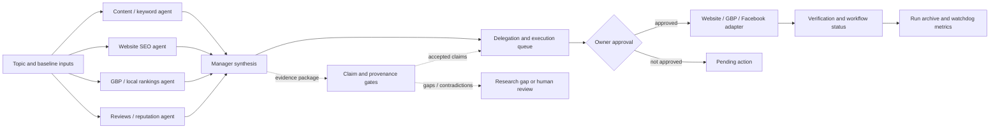

# SEO Agents App — Evidence-First Research-to-Execution Plan

## Outcome

Upgrade `C:\Workspace\Active\SEO-Agents-App` so SEO research becomes a
provenance-preserving, confidence-gated, dependency-aware execution plan while
preserving the existing CrewAI phases, Markdown outputs, JSON status, approval
boundaries, website adapter, and scheduled GBP-worker ownership.

This plan is based on the validated package archived under
`C:\Workspace\Archive\Agent-Orchestration\SEO-Agents-App\seo-e2e-20260713-001`.

The package is accepted for plan-only work with conditions. Worker 1's original
dispatch timed out, then the approved recovery dispatch
`ctx_6a6e7aae3999` emitted a valid `worker_done` at sequence 91. That recovery
completion supersedes the earlier no-`worker_done` characterization without
erasing the original timeout, heartbeat gap, missing phase signals, or recovery
delay. Worker 2/3 duplicate completions, Worker 3's post-completion heartbeat,
and missing `research_completed` signals for Workers 2/4/5 remain explicit
lifecycle defects. Worker 4/5 numeric thresholds are proposed defaults requiring
calibration after three representative runs.

## Non-goals

- Do not change the application during this planning handoff.
- Do not publish, push, run live adapters, post to GBP/Facebook, or alter Supabase
  data as part of implementation sessions.
- Do not claim access to Search Console, rankings, GBP state, or proprietary Google
  metrics without captured evidence.
- Do not replace CrewAI, the existing approval workflow, the website adapter, or
  the scheduled GBP-worker ownership model.

## Codebase primer

Target repository: `C:\Workspace\Active\SEO-Agents-App`

| Path | Contract to preserve or extend |
|---|---|
| `src/seo_agents/crew.py` | Builds research specialists, manager, scheduler, tools, LLM tiers, Markdown outputs. |
| `src/seo_agents/main.py` | CLI phase orchestration: research, execute, status, validate, adapter commands. |
| `src/seo_agents/actions.py` | Parses plans/queues into approval-gated action objects and adapter state. |
| `src/seo_agents/status.py` | Produces `outputs/workflow_status.json` and validates output presence/markers. |
| `src/seo_agents/website.py` | Website preview/live adapter boundary. |
| `prompts/agents/*.txt` | Specialist, manager, scheduler, and executor behavior contracts. |
| `knowledge/baselines/*.md` | Historical evidence; must gain freshness/supersession metadata. |
| `outputs/` | Human-readable plans and machine-readable status/action records. |
| `scripts/mav-bridge.mjs` | Operational bridge; GBP remains owned by scheduled worker unless rollback flag is explicit. |
| `scripts/lib/*.mjs` | Adapter helpers with existing Node test coverage. |
| `supabase/schema.sql`, `supabase/migrations/*.sql` | External run/action storage contracts; inspect before adding fields. |
| `docs/runbooks/gbp-worker.md` | GBP ownership and recovery rules. |

Current research flow:



## Target contracts

The executor should add these contracts without removing existing Markdown
outputs. Use stable IDs and preserve unknowns rather than filling them with model
inference.

### Evidence unit and claim object

```json
{
  "evidence_id": "ev_<run_id>_<sequence>",
  "run_id": "2026-07-13T08:30:00Z_<topic_slug>",
  "claim_id": "claim_<stable_hash>",
  "claim_type": "observation|policy|recommendation|hypothesis|negative_finding",
  "statement": "Atomic claim in one sentence.",
  "scope": {"site": "https://www.grizzlyelectricaltx.com/", "region": "DFW, Texas"},
  "source": {
    "kind": "live_page|google_policy|serp|baseline|owner_input|tool_output",
    "uri": "https://example.com/source",
    "title": "Source title",
    "retrieved_at": "2026-07-13T08:30:00Z",
    "authority_rank": 1,
    "access_class": "observed|provided|inferred|unavailable"
  },
  "evidence_excerpt": "Short supporting excerpt or structured observation.",
  "relation": "supports|weakens|contradicts|insufficient",
  "confidence": {
    "label": "high|medium|low|unknown",
    "score": 0.0,
    "authority": 0.0,
    "recency": 0.0,
    "method_transparency": 0.0,
    "corroboration": 0.0,
    "access": 0.0,
    "basis": "Why this label and score were assigned."
  },
  "freshness": {"captured_at": "2026-07-13T08:30:00Z", "valid_until": null, "supersedes": []},
  "contradiction_ids": [],
  "reproducibility_key": "sha256:...",
  "supporting_report": "content_report.md",
  "status": "confirmed|provisional|unknown|rejected"
}
```

### Execution task object

```json
{
  "task_id": "T-<run_id>-001",
  "run_id": "2026-07-13T08:30:00Z_<topic_slug>",
  "title": "Concrete action title",
  "task_type": "technical_fix|content_update|local_update|review_work|research_gap|monitoring_alert_check",
  "supporting_claim_ids": ["claim_<stable_hash>"],
  "owner": "website_manager|content_executor|local_presence_assets|owner_review",
  "priority": {"tier": "P0|P1|P2|P3", "score": 0.0, "formula_version": "priority-v1"},
  "confidence": {"label": "high|medium|low|unknown", "score": 0.0},
  "dependencies": [],
  "preconditions": ["Required evidence or approval condition."],
  "acceptance_criteria": ["Observable definition of done."],
  "verification": {"command": "powershell command or adapter check", "expected": "Expected result"},
  "rollback": "Specific reversible action.",
  "approval_class": "none|sampled|mandatory",
  "uncertainty": {"proxy_metrics_used": [], "gap_reason": null, "blocked_by": []},
  "idempotency_key": "sha256:...",
  "status": "research_gap|ready|waiting_on_owner|waiting_on_tool_access|approved|executing|verified|blocked"
}
```

### Required output additions

Add these as additive outputs under the existing `outputs/` directory:

- `run_manifest.json`
- `evidence_package.json`
- `claim_graph.json`
- `task_graph.json`
- `observability.jsonl`

Keep the existing Markdown projections and add lineage fields to action/status
objects rather than changing existing consumers without compatibility tests.

## Orchestration hardening prerequisite

Do this before the next full multi-agent run and before any implementation
session starts. The failure mode to eliminate is an agent terminal waiting on a
local trust or edit-permission prompt while the coordinator believes it is
running.

### Permission and trust launch profile

All orchestration terminals must be launched from a profile that has already
accepted workspace trust or runs in a documented noninteractive mode that cannot
show trust prompts.

Minimum launch settings by agent family:

| Agent family | Required launch mode for orchestration |
|---|---|
| Codex | `codex --dangerously-bypass-approvals-and-sandbox --dangerously-bypass-hook-trust -a never -s danger-full-access --no-alt-screen -C <workspace>` |
| Claude validator/planner | Prefer noninteractive `claude -p --permission-mode bypassPermissions --dangerously-skip-permissions --model <model> ...` because Claude documents that `-p` skips the workspace trust dialog; if interactive Claude is used, preflight must prove it reached an idle prompt before dispatch. |
| OpenCode fallback | `opencode <workspace> --auto --model <provider/model>` and route metadata must record `providerRoute=opencode-fallback`. |

Never rely on "the worker will click through it." A terminal that is still at a
trust, approval, or edit-permission prompt is not dispatchable.

### Preflight gate

Before dispatching workers, the orchestrator must run a preflight against every
planned terminal and fail fast if any check fails:

1. Terminal is writable and has reached an agent-ready or shell-ready state.
2. Agent can read the run manifest and role contract.
3. Agent can write and delete a disposable probe file under
   `artifacts/<run-id>/preflight/<role>-<terminal>.tmp`.
4. Agent can send an Orca lifecycle `heartbeat` containing `taskId` and
   `dispatchId`.
5. No prompt text matching workspace trust, edit approval, shell approval,
   permission request, or "quick safety check" appears in the terminal tail.
6. The preflight record is written to
   `artifacts/<run-id>/preflight/summary.json` before research dispatch begins.

Smallest recovery for a failed preflight: close or quarantine the bad terminal,
create a new terminal with the required launch profile, and rerun only the
preflight. Do not dispatch a research worker into a terminal that has not passed
the probe.

### Completion packet and cleanup contract

Every lifecycle completion must be sent with syntactically valid JSON and both
Orca authority IDs:

```powershell
orca orchestration send --to <orchestrator-handle> `
  --type worker_done `
  --subject "<role complete>" `
  --body "<exactly three sentences: what changed, what was found, what remains>" `
  --payload '{"taskId":"<task-id>","dispatchId":"<dispatch-id>","filesModified":["artifacts/<run-id>/..."],"reportPath":"artifacts/<run-id>/..."}' `
  --json
```

Do not use bare keys, single quotes inside JSON, missing quotes around strings,
or payloads that omit `taskId` or `dispatchId`. A malformed packet is logged as
a lifecycle defect and must be followed by exactly one corrected packet; the
malformed packet is ignored for completion authority.

After a terminal sends its valid final packet, it must stop polling, stop
emitting heartbeats, and return to an idle prompt. The orchestrator then closes
completed worker, supervisor, validator, and planner tabs that are no longer
needed with `orca terminal close --terminal <handle> --json`, after first
exporting any requested diagnostics. Keep only the active orchestrator terminal
and any terminal explicitly retained for investigation.

### Diagnostics export contract

Before closing completed tabs, export the runtime state needed for failure
analysis:

```powershell
orca orchestration inbox --limit 500 --json > artifacts/<run-id>/diagnostics/orchestration-inbox-raw.json
orca orchestration task-list --json > artifacts/<run-id>/diagnostics/task-list.json
orca terminal list --json > artifacts/<run-id>/diagnostics/terminal-list.json
orca orchestration dispatch-show --task <task-id> --json > artifacts/<run-id>/diagnostics/dispatch-<task-id>.json
orca terminal read --terminal <handle> --limit 5000 --json > artifacts/<run-id>/diagnostics/terminal-tails/<handle>.json
```

The diagnostics bundle for this run is already present at
`artifacts/seo-e2e-20260713-001/diagnostics/` and should be used to analyze the
trust-prompt block, malformed validator packet, duplicate `worker_done`
messages, missing lifecycle phases, and spinner-only worker behavior.

### Two-window Orca layout

Use two visible split groups so monitoring and coordination are not mixed with
research output:

```text
Window A: WORKERS + WORKER-SUPERVISOR
┌─────────────┬─────────────┬─────────────┐
│ WORKER-1    │ WORKER-2    │ WORKER-3    │
├─────────────┼─────────────┼─────────────┤
│ WORKER-4    │ WORKER-5    │ SUPERVISOR  │
└─────────────┴─────────────┴─────────────┘

Window B: ORCHESTRATOR + VALIDATOR + PLANNER
┌─────────────────┬─────────────────┬─────────────────┐
│ ORCHESTRATOR    │ VALIDATOR       │ PLANNER         │
└─────────────────┴─────────────────┴─────────────────┘
```

If Orca cannot create separate OS windows from the CLI, use two Orca tabs or
visual groups with those exact titles. The important invariant is that workers
and the worker supervisor share one inspection surface, while orchestrator,
validator, and planner share the other.

CLI shape, to be adapted to live terminal handles:

```powershell
orca terminal rename --terminal <worker1> --title "WORKER-1" --json
orca terminal split --terminal <worker1> --direction vertical --command "<worker-launch>" --json
orca terminal split --terminal <worker2> --direction vertical --command "<worker-launch>" --json
orca terminal split --terminal <worker3> --direction horizontal --command "<worker-launch>" --json
orca terminal split --terminal <worker4> --direction vertical --command "<worker-launch>" --json
orca terminal split --terminal <worker5> --direction vertical --command "<supervisor-launch>" --json

orca terminal rename --terminal <orchestrator> --title "ORCHESTRATOR" --json
orca terminal split --terminal <orchestrator> --direction vertical --command "<validator-launch>" --json
orca terminal split --terminal <validator> --direction vertical --command "<planner-launch>" --json
```

Do not start the full run until both windows are visible, named, and preflight
has passed for every terminal.

## Implementation sessions

Each session ends at a verified, commit-ready boundary. Sessions modify only the
target repository; the orchestration repository keeps this plan and validation
record.

### Session 1 — Contracts and run lineage

Tasks:

1. Add the evidence/claim/task Pydantic or dataclass contracts in
   `src/seo_agents/contracts.py` and serialization helpers in
   `src/seo_agents/evidence.py`.
2. Add a deterministic run ID and route/tool metadata to the research context in
   `src/seo_agents/crew.py` and `src/seo_agents/main.py`.
3. Add compatibility-safe output writers for `run_manifest.json`,
   `evidence_package.json`, and `claim_graph.json`; do not remove Markdown files.

Verification:

```powershell
Set-Location C:\Workspace\Active\SEO-Agents-App
$env:PYTHONPATH='src'
\.venv\Scripts\python.exe -m seo_agents.main research "electrical troubleshooting service page" --dry-run
Test-Path outputs\run_manifest.json
Test-Path outputs\evidence_package.json
Test-Path outputs\claim_graph.json
Get-Content outputs\run_manifest.json -Raw | ConvertFrom-Json | Select-Object run_id,provider,model
```

Expected: dry-run exits successfully; all three JSON files parse; the run ID is
stable for the run and route metadata is present. No live LLM or adapter call.

Commit boundary: `Add evidence and run lineage contracts`.

### Session 2 — Evidence collection and synthesis gates

Tasks:

1. Update `prompts/agents/content-keyword-agent.txt`,
   `website-seo-agent.txt`, `gbp-local-rankings-agent.txt`, and
   `reviews-reputation-agent.txt` so every durable recommendation emits claim
   fields, source mode (`live`, `baseline`, `unavailable`), retrieval time, and
   explicit negative findings.
2. Update `prompts/agents/local-presence-manager-agent.txt` to preserve claim IDs,
   detect contradictions, record suppressed findings, and reject unsupported
   promotion.
3. Add validation in `src/seo_agents/evidence.py` and wire it into
   `src/seo_agents/status.py` so missing provenance, stale evidence, high
   confidence on weak sources, unresolved material contradictions, and secrets
   cause a gate failure or research-gap result.

Verification:

```powershell
Set-Location C:\Workspace\Active\SEO-Agents-App
$env:PYTHONPATH='src'
\.venv\Scripts\python.exe -m pytest -q tests\test_evidence_contracts.py tests\test_synthesis_gates.py
\.venv\Scripts\python.exe -m seo_agents.main validate --json
```

Expected: fixture tests cover live/baseline/unavailable evidence, stale sources,
contradiction, unsupported high confidence, and negative findings. `validate`
reports machine-readable gate results and does not promote failed claims.

Commit boundary: `Add evidence provenance and synthesis gates`.

### Session 3 — Research-to-execution translation

Tasks:

1. Update `prompts/agents/delegation-scheduling-agent.txt` with the Worker 4
   Claim → Decomposition → Sequencing gates and the task object contract.
2. Extend `src/seo_agents/actions.py` to preserve `supporting_claim_ids`,
   confidence, dependencies, verification, rollback, approval class, uncertainty,
   and idempotency key while keeping current action fields.
3. Extend `src/seo_agents/status.py` and `src/seo_agents/main.py` to write
   `task_graph.json`, create `research_gap`/`waiting_on_owner` tasks, reject cycles,
   and prevent queue promotion when material contradictions remain unresolved.

Priority formula version 1:

```text
priority_score = 0.35 * impact + 0.30 * confidence + 0.20 * urgency + 0.15 * strategic_alignment
P0: score >= 0.80, confidence high, no unresolved material contradiction
P1: score >= 0.60, confidence medium or higher
P2: score >= 0.40, confidence low or higher
P3: score < 0.40 or confidence unknown; research-gap preferred when evidence is missing
```

These thresholds are proposed defaults. Record `formula_version` and calibrate in
Session 5; do not present them as Google rules.

Verification:

```powershell
Set-Location C:\Workspace\Active\SEO-Agents-App
$env:PYTHONPATH='src'
\.venv\Scripts\python.exe -m pytest -q tests\test_task_translation.py tests\test_action_queue_lineage.py
\.venv\Scripts\python.exe -m seo_agents.main research "electrical troubleshooting service page" --dry-run
Get-Content outputs\task_graph.json -Raw | ConvertFrom-Json | Select-Object -ExpandProperty tasks
```

Expected: every promoted task has at least one supporting claim, acceptance
criteria, verification, rollback, and idempotency key; unresolved claims become
research gaps or blocked tasks; existing approval fields remain compatible.

Commit boundary: `Make execution queue evidence-bound and dependency-aware`.

### Session 4 — Operations, review, and adapter safety

Tasks:

1. Add structured events in `src/seo_agents/observability.py` and emit them from
   research, synthesis, queue, approval, adapter, and verification boundaries.
2. Add review classification and failure-specific recovery in
   `src/seo_agents/actions.py` and `src/seo_agents/main.py`: transient retry,
   evidence-access escalation, contradiction-stall escalation, confidence-gap
   research task, and secrets quarantine.
3. Add deterministic idempotency enforcement to website/GBP/Facebook paths without
   changing GBP ownership in `scripts/mav-bridge.mjs` or
   `docs/runbooks/gbp-worker.md`.

Initial metrics to emit, explicitly marked `proposed`:

- claim validity rate;
- contradiction density;
- evidence-to-task binding rate;
- gate pass rates for Claim, Decomposition, and Sequencing;
- dependency-cycle rate;
- review escalation rate;
- retry rate by failure class;
- p50/p95 latency and cost by task type;
- adapter dedupe/idempotency outcomes;
- research-gap closure rate.

Verification:

```powershell
Set-Location C:\Workspace\Active\SEO-Agents-App
$env:PYTHONPATH='src'
\.venv\Scripts\python.exe -m pytest -q tests\test_observability.py tests\test_idempotency.py
node --test scripts\lib\*.test.mjs
\.venv\Scripts\python.exe -m seo_agents.main validate --json
```

Expected: structured JSONL events include `run_id`, `task_id` when applicable,
`gate_id`, timestamp, producer, and metric. Retry tests prove that repeated
action keys do not create duplicate external side effects. Existing Node adapter
tests remain green.

Commit boundary: `Add lifecycle observability and safe recovery controls`.

### Session 5 — Regression corpus, calibration, and pilot gate

Tasks:

1. Add `tests/fixtures/research/` with fixtures for a supported claim, stale
   baseline, unavailable SERP, conflicting specialists, proxy metric, missing
   evidence, secrets-like text, and an idempotent retry.
2. Add `tests/test_research_regression.py` covering Worker 3 acceptance checks
   A1–A10 and Worker 5 gate metrics; keep all thresholds labeled as proposed until
   observed data exists.
3. Add a `monitoring_alert_check`/T10 watchdog path and run three dry-run cycles
   using the same representative topic set. Record calibration results in
   `outputs/archive/` and update thresholds only from observed data with a versioned
   change note.

Verification:

```powershell
Set-Location C:\Workspace\Active\SEO-Agents-App
$env:PYTHONPATH='src'
\.venv\Scripts\python.exe -m pytest -q
\.venv\Scripts\python.exe -m seo_agents.main research "electrical troubleshooting service page" --dry-run
\.venv\Scripts\python.exe -m seo_agents.main validate --json
Get-Content outputs\workflow_status.json -Raw | ConvertFrom-Json | Select-Object status,next_action
```

Expected: full Python and existing Node suites pass; three dry runs produce
lineage-linked packages and no live side effects; watchdog events are advisory by
default and blocking only on explicit critical gates; calibration records state
sample size, threshold version, and unresolved negative findings.

Commit boundary: `Add research regression corpus and pilot calibration`.

## Acceptance criteria for the completed implementation

- Every durable research claim has provenance, retrieval/freshness metadata,
  source authority, evidence excerpt or structured observation, confidence basis,
  relation, and stable claim ID.
- Live, baseline, and unavailable search modes are machine-distinguishable.
- Unsupported claims, stale evidence, secrets, and unresolved material conflicts
  cannot silently become executable tasks.
- Every executable task links to one or more claims and includes owner, priority
  formula version, dependencies, preconditions, acceptance criteria, verification,
  rollback, approval class, uncertainty, and idempotency key.
- Research gaps and owner/tool waits remain visible rather than being dropped.
- `workflow_status.json`, action queue objects, archives, and observability events
  share a run lineage ID.
- Existing dry-run, approval, website adapter, GBP scheduled-worker, and Node
  helper-test behavior remains compatible.
- Proposed thresholds are not described as validated until three representative
  dry-run cycles produce calibration evidence.
- No external side effect occurs without existing approval and adapter ownership
  rules.

## Risks and rollback

| Risk | Mitigation | Rollback |
|---|---|---|
| Existing consumers reject additive JSON fields | Preserve old keys and add compatibility tests | Disable new projection writers; retain Markdown/status path. |
| Prompt/schema mismatch drops reports | Fail closed into `research_gap`; keep raw report | Revert prompt version and replay archived input. |
| Confidence thresholds over-block useful work | Record proposed version and calibration metrics | Lower only through versioned calibration decision; do not bypass gate. |
| Duplicate adapter actions | Deterministic idempotency key and persistent claim state | Disable live adapter path; use dry-run and pending approval. |
| GBP double ownership | Keep scheduled worker as owner and bridge flag off | Stop bridge, leave scheduled worker unchanged. |
| Evidence contains secrets | Secrets scan before persistence and quarantine | Remove/quarantine artifact, rotate credential if needed, replay from clean input. |
| Stale baseline re-enters queue | Freshness/supersession fields and validation | Mark baseline unavailable and require new evidence. |

Rollback procedure for any session: stop at the session boundary, preserve the
failed fixture/output archive, revert only that session's commit on the existing
branch, and rerun the prior session's verification commands. Do not reset unrelated
user changes.

## Copy-pasteable executor prompts

### Orchestration preflight prompt

```text
You are preparing the next Orca multi-agent run. Plan file: C:\Workspace\Active\SEO-Agents-App\PLAN.md. Execute only the Orchestration hardening prerequisite section; do not start worker research, validation, planning, or target-app implementation.

Create the two visible split groups: Window A contains WORKER-1 through WORKER-5 plus SUPERVISOR, and Window B contains ORCHESTRATOR, VALIDATOR, and PLANNER. Launch every agent terminal with its required bypass/noninteractive profile: Codex uses --dangerously-bypass-approvals-and-sandbox, --dangerously-bypass-hook-trust, -a never, and -s danger-full-access; Claude validator/planner uses noninteractive -p where possible, otherwise --permission-mode bypassPermissions and --dangerously-skip-permissions plus a mandatory idle-prompt check; OpenCode fallback uses --auto. Run the preflight probe for each terminal: writable terminal, role contract readable, disposable preflight file write/delete under artifacts/<run-id>/preflight/, heartbeat with taskId and dispatchId, and terminal tail free of trust/approval prompts. Write artifacts/<run-id>/preflight/summary.json with pass/fail per terminal. Verify every role prompt includes the exact JSON worker_done packet shape and the close-when-done cleanup rule. Stop before dispatching research workers.
```

### Session 1 prompt

```text
You are executing Session 1 of the SEO Agents App evidence-first research-to-execution plan. Plan file: C:\Workspace\Active\SEO-Agents-App\PLAN.md. Feature: evidence contracts and run lineage. Working tasks: 1 through 3. Working branch: existing checkout branch; do not create or publish a branch. Environment: Windows / PowerShell.

Read the Codebase Primer completely before editing. Execute only Session 1 tasks. Add the exact evidence/claim/task contracts and additive run-manifest/evidence/claim-graph writers described in the plan. Do not change the orchestration repository, publish changes, call live adapters, or run a live LLM. Run every Session 1 verification command. Make only the commit specified: Add evidence and run lineage contracts. Return completed tasks, files changed, command outputs, and commit hash. Stop for Codex verification.
```

### Session 2 prompt

```text
You are executing Session 2 of the SEO Agents App evidence-first research-to-execution plan. Plan file: C:\Workspace\Active\SEO-Agents-App\PLAN.md. Feature: evidence provenance and synthesis gates. Working tasks: 1 through 3 of Session 2. Working branch: existing checkout branch; do not create or publish a branch. Environment: Windows / PowerShell.

Read the Codebase Primer and inspect Session 1's changed files. Execute only the prompt-contract and evidence-validation tasks in Session 2. Preserve unknowns, negative findings, source mode, freshness, contradictions, and confidence basis. Run the two planned verification commands. Make only the commit specified: Add evidence provenance and synthesis gates. Return files, outputs, and commit hash. Stop for Codex verification.
```

### Session 3 prompt

```text
You are executing Session 3 of the SEO Agents App evidence-first research-to-execution plan. Plan file: C:\Workspace\Active\SEO-Agents-App\PLAN.md. Feature: evidence-bound execution queue. Working tasks: 1 through 3 of Session 3. Working branch: existing checkout branch; do not create or publish a branch. Environment: Windows / PowerShell.

Inspect the Codebase Primer and prior verified sessions. Execute only task translation, queue lineage, uncertainty handling, and dependency validation. Keep existing action fields and approval behavior. Treat priority thresholds as proposed engineering defaults and preserve formula_version. Run every Session 3 command. Make only the commit specified: Make execution queue evidence-bound and dependency-aware. Return files, outputs, and commit hash. Stop for Codex verification.
```

### Session 4 prompt

```text
You are executing Session 4 of the SEO Agents App evidence-first research-to-execution plan. Plan file: C:\Workspace\Active\SEO-Agents-App\PLAN.md. Feature: lifecycle observability and safe recovery. Working tasks: 1 through 3 of Session 4. Working branch: existing checkout branch; do not create or publish a branch. Environment: Windows / PowerShell.

Execute only structured events, risk-based review/recovery, and adapter idempotency work. Preserve approval gates and scheduled GBP-worker ownership. Do not enable live posting. Run Python observability/idempotency tests and existing Node helper tests. Make only the commit specified: Add lifecycle observability and safe recovery controls. Return files, outputs, and commit hash. Stop for Codex verification.
```

### Session 5 prompt

```text
You are executing Session 5 of the SEO Agents App evidence-first research-to-execution plan. Plan file: C:\Workspace\Active\SEO-Agents-App\PLAN.md. Feature: research regression corpus and pilot calibration. Working tasks: 1 through 3 of Session 5. Working branch: existing checkout branch; do not create or publish a branch. Environment: Windows / PowerShell.

Execute only fixture/regression, watchdog, and three-cycle dry-run calibration work. Never call live adapters or publish. Keep thresholds labeled proposed until the required three representative dry runs are complete. Run every Session 5 verification command. Make only the commit specified: Add research regression corpus and pilot calibration. Return fixtures, outputs, command results, and commit hash. Stop for Codex verification.
```

## Final handoff state

Planning gate: accepted with conditions.

Validated research package:
`C:\Workspace\Archive\Agent-Orchestration\SEO-Agents-App\seo-e2e-20260713-001\validation\research-package.md`

Lifecycle certification:
`C:\Workspace\Archive\Agent-Orchestration\SEO-Agents-App\seo-e2e-20260713-001\supervisor\lifecycle.md`

Next full orchestration run prerequisite:
complete the `Orchestration hardening prerequisite` section before dispatching
workers.

No implementation has been performed in `C:\Workspace\Active\SEO-Agents-App`.

## Clean & Archive phase

Run this phase after `PLAN.md` is ready and before reusing the orchestration
workspace for another target:

1. Copy the final `PLAN.md` into the target repository root.
2. Create an archive path:
   `C:\Workspace\Archive\Agent-Orchestration\<target-repo-name>\<run-id>\`.
3. Copy the final `PLAN.md` into that archive path.
4. Move `artifacts/<run-id>/` into the archive path.
5. Export a final terminal inventory to the run diagnostics before closing tabs.
6. Close completed worker, supervisor, validator, and planner tabs that are not
   needed for investigation.
7. Leave the orchestration repository with no active run artifacts except the
   reusable role contracts and any current root `PLAN.md` needed for reference.

For this run, the target plan path is
`C:\Workspace\Active\SEO-Agents-App\PLAN.md`, and the archive path is
`C:\Workspace\Archive\Agent-Orchestration\SEO-Agents-App\seo-e2e-20260713-001`.
